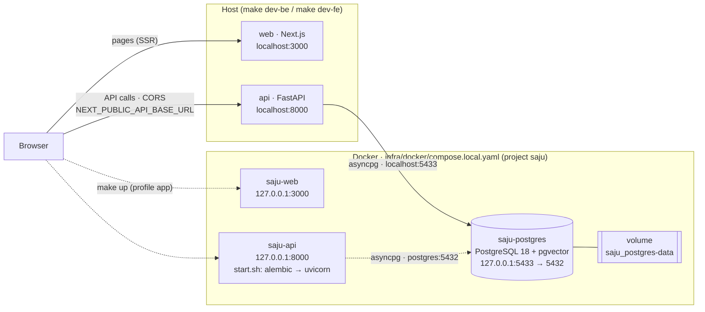
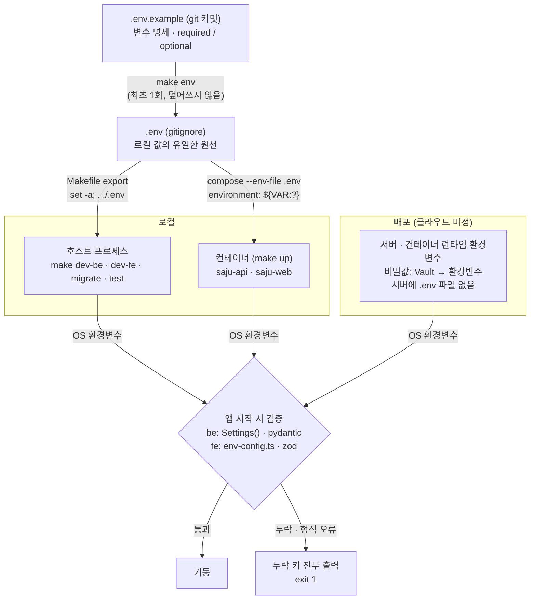

# Service (이름 미정)

해외 사용자를 위한 **K-사주 리포트 서비스**. 생년월일시와 출생 도시를 입력하면 동양 사주(자평명리)로 명식을 계산해
무료 짧은 리포트를 바로 보여주고, 더 보고 싶으면 크레딧으로 AI 상세 리포트를 생성한다.

## 한눈에 보기

| 항목 | 내용 |
| --- | --- |
| 대상 | 해외 사용자 · 한국어(기본 `/`)와 영어(`/en`)로 출시 |
| 형태 | 대화형이 아니라 입력 → 결과. 구독 없음 |
| 무료 | 가입 없이 아키타입 카드 · 명식표 · 오행 균형 · 짧은 요약. AI 없이 미리 만든 콘텐츠로 생성 (비용 0) |
| 유료 | 상세 리포트 = 3크레딧. 크레딧 1개 $0.99, 묶음 1 · 3 · 10(+1) · 100(+20), 첫 구매 +1 |
| 결제 | Toss Payments (해외 카드 + PayPal, USD). 크레딧 유효기간 결제 5년 · 보너스 1년, 7일 청약 철회 · 잔액 환불 |
| 회원 | 결제할 때만 가입 (Google · Apple · 이메일 링크, 비밀번호 없음). 비회원 입력은 서버에 저장하지 않음 |
| 계산 기준 | 자평명리 · 출생 도시 경도 보정 · 야자시 · 시각 모르면 정오 추정 · 서머타임 반영 |
| 화면 | 랜딩 · 리딩 · 가격·결제 · 로그인 · 보고서 · 마이페이지 (+ 약관 · 개인정보 · 환불 정책) |
| 운영 기준 | 한국법 기준, 해외는 GDPR · 디지털 상품 세금 · 청약 철회 고지를 최소선으로 |

## 현재 상태

- **기획**: 정책 [`plan-v0.1.0`](docs/policies/README.md) — 회원 · 결제 · AI 사용 내역 · i18n 합의, 사주는 "보고서"로 추상화하고 심층 설계 중. 사주까지 끝나면 v1.0.0.
- **개발**: 스캐폴딩 완료 — be(FastAPI · health · Alembic · pgvector), fe(Next.js 16 · shadcn/ui · `/design` 토큰 미리보기), 로컬 compose · Makefile.
- **배포**: 설계안만 있음 (클라우드 미정).

## 스택

| 영역 | 기술 |
| --- | --- |
| be | FastAPI · uv · SQLAlchemy(async) · Alembic · PostgreSQL 18 + pgvector |
| fe | Next.js 16 · pnpm · Tailwind v4 · shadcn/ui · TanStack Query · next-intl |
| AI | be 안의 `ai` 모듈 (LLM · 임베딩 provider는 교체 가능한 포트), Postgres job 테이블 + worker |
| 로컬 | Docker Compose (`infra/docker/compose.local.yaml`) · Makefile |
| 배포 | fe Vercel · be 관리형 컨테이너 · 관리형 PostgreSQL · Terraform (예정) |

## 문서

| 폴더 | 내용 |
| --- | --- |
| [`docs/policies/`](docs/policies/README.md) | 정책 (결정의 단일 원천, 정책 ID로 관리) |
| [`docs/planning/`](docs/planning/user-journey.md) | 경쟁 분석 · 유저 저니 · 사이트맵 |
| [`docs/architecture/`](docs/architecture/domains.md) | 도메인 경계 · AI 모듈 · i18n · 환경변수 · 배포 인프라 |

문서 전체 안내는 [`docs/README.md`](docs/README.md), 작업 규칙은 [`AGENTS.md`](AGENTS.md).

## Local architecture



- 실선: 평소 개발 — `make db` 로 postgres만 컨테이너, api·web은 호스트 프로세스.
- 점선: 통합 확인 — `make up` 으로 api·web도 컨테이너(profile `app`). 같은 3000/8000 포트를 쓰므로 둘 중 하나만 띄운다.
- `make down` 은 api·web만 내리고 postgres는 유지한다.

## Deployment architecture (설계안)


prod 단일 · fe는 Vercel · be(api·worker·migrate)는 관리형 컨테이너 · 관리형 PostgreSQL + pgvector · 서비스명·도메인·클라우드 미정.
네트워크 규칙, 클라우드별 대응, 배포 흐름은 [`docs/architecture/infra.md`](docs/architecture/infra.md)를 본다.

## Environment variables



> fe 예외: `NEXT_PUBLIC_*`는 빌드 시 JS 번들에 박힌다 → docker build arg로 전달하고 빌드 단계에서 검증한다.

- 변수 추가·변경은 `.env.example`에 먼저 적는다 (`# required` / `# optional (default: X)`).
- 앱은 `.env`를 직접 읽지 않는다. 필수 값이 없으면 기동하지 않는다.
- 자세한 규칙과 검증 지점: [`docs/architecture/env.md`](docs/architecture/env.md)

## Quick start

```sh
make env         # create .env from .env.example (see docs/architecture/env.md)

make db          # start postgres only (127.0.0.1:5433)
make migrate     # apply backend migrations
make dev-be      # run the backend locally (127.0.0.1:8000)
make dev-fe      # run the frontend locally (127.0.0.1:3000), in another shell
```

Or run everything in containers:

```sh
make up          # build + start api, web, postgres
make down        # stop api+web (postgres keeps running)
```

## Checks

```sh
make lint
make test
make fmt
```

See `be/README.md` and `fe/README.md` for per-app details.
