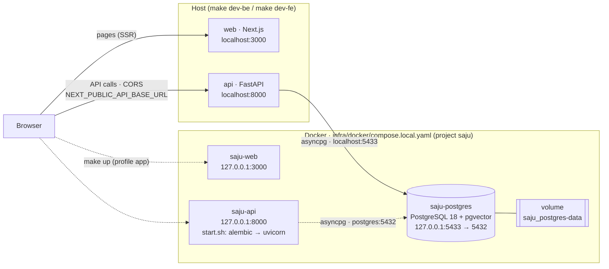

# saju

FastAPI backend (`be/`) + Next.js frontend (`fe/`) + PostgreSQL, orchestrated
with Docker Compose. See `AGENTS.md` for project conventions and routing.

## Local architecture



- 실선: 평소 개발 — `make db` 로 postgres만 컨테이너, api·web은 호스트 프로세스.
- 점선: 통합 확인 — `make up` 으로 api·web도 컨테이너(profile `app`). 같은 3000/8000 포트를 쓰므로 둘 중 하나만 띄운다.
- `make down` 은 api·web만 내리고 postgres는 유지한다.

## Quick start

```sh
cp .env.example .env
cp be/.env.example be/.env
cp fe/.env.example fe/.env

make db          # start postgres only (127.0.0.1:5433)
make migrate     # apply backend migrations
make dev-be      # run the backend locally (127.0.0.1:8000)
make dev-fe      # run the frontend locally (127.0.0.1:3000), in another shell
```

Or run everything in containers:

```sh
make up          # build + start api, web, postgres
make down        # stop api+web (postgres keeps running)
```

## Checks

```sh
make lint
make test
make fmt
```

See `be/README.md` and `fe/README.md` for per-app details.
