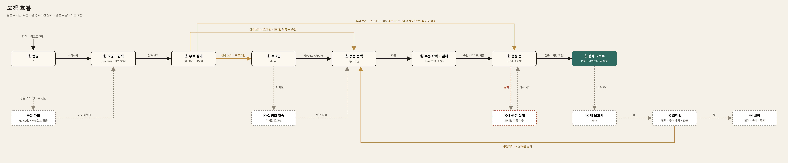
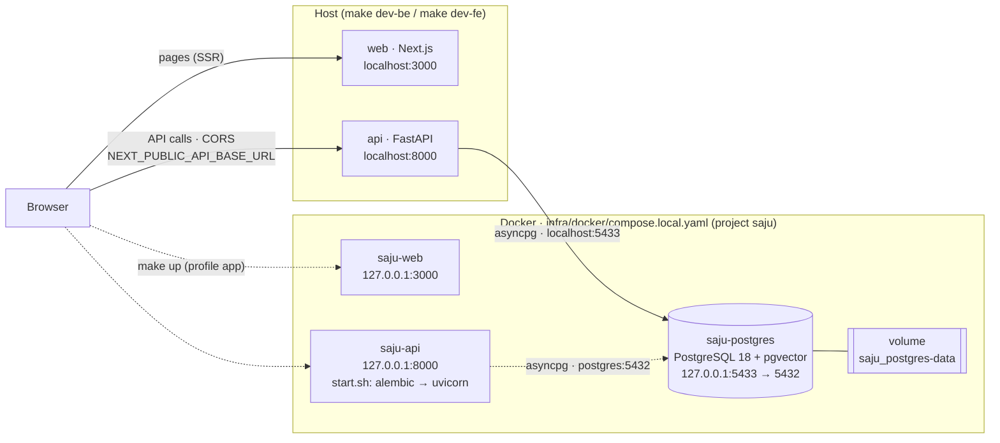

# Service (이름 미정)

해외 사용자를 위한 K-사주 리포트 서비스. 생년월일시와 출생 도시를 입력하면 명식을 계산해 무료 리포트를 보여주고,
크레딧으로 AI 상세 리포트를 생성한다.

## 주요 기능

- 가입 없이 입력 → 무료 리포트 (아키타입 카드 · 명식표 · 오행 균형 · 짧은 요약)
- 크레딧으로 AI 상세 리포트 생성 · PDF 다운로드
- 한국어 · 영어 지원 (`/`, `/en`)
- 결제 시점 가입 (Google · Apple · 이메일 링크)

가격·환불·회원 등 운영 정책은 [`docs/policies/`](docs/policies/README.md)를 본다.

## 화면 흐름



랜딩 → 입력 → 무료 결과(가입 없음) → 로그인 → 크레딧 충전 → 결제 → 상세 리포트 생성. 화면 6개 + 마이페이지이며,
화면별 와이어프레임과 상세 흐름은 [`docs/planning/flow.md`](docs/planning/flow.md)를 본다.

## 기술 스택

| 영역 | 기술 |
| --- | --- |
| Backend | FastAPI · SQLAlchemy(async) · Alembic · uv |
| Frontend | Next.js 16 · Tailwind v4 · shadcn/ui · TanStack Query · pnpm |
| Database | PostgreSQL 18 + pgvector |
| AI | be 내부 `ai` 모듈 · Postgres job 테이블 + worker |
| Local | Docker Compose · Makefile |
| Deploy (예정) | Vercel (fe) · 관리형 컨테이너 (be) · Terraform |

## 시작하기

필요한 도구: [Docker](https://www.docker.com/), [uv](https://docs.astral.sh/uv/) (Python 3.14는 uv가 설치), Node.js 24+ (LTS), [pnpm](https://pnpm.io/) 11

```sh
make env       # .env.example → .env (최초 1회)
make db        # PostgreSQL 기동 (127.0.0.1:5433)
make migrate   # DB 마이그레이션
make dev-be    # 백엔드 http://localhost:8000 (API 문서 /docs)
make dev-fe    # 프론트엔드 http://localhost:3000 (다른 터미널에서)
```

전체를 컨테이너로 띄우려면 `make up`, 내리려면 `make down` (postgres는 유지). 전체 명령은 `make help`.

## 프로젝트 구조

```text
.
├── be/                      # FastAPI 백엔드
├── fe/                      # Next.js 프론트엔드
├── infra/
│   ├── docker/              # 로컬 개발용 compose
│   └── terraform/           # 배포 인프라 (예정)
├── docs/                    # 정책 · 기획 · 기술 설계
├── Makefile                 # 실행 · 검증 진입점
└── .env.example             # 환경변수 명세
```

## 아키텍처

로컬 개발 구성:



- 실선: 평소 개발 — `make db`로 postgres만 컨테이너, be·fe는 호스트에서 실행.
- 점선: 통합 확인 — `make up`으로 be·fe도 컨테이너로 실행 (같은 3000/8000 포트라 둘 중 하나만).

배포 구성은 [`docs/architecture/infra.md`](docs/architecture/infra.md), 환경변수 흐름은 [`docs/architecture/env.md`](docs/architecture/env.md)를 본다.

## 개발 명령

```sh
make lint      # be(ruff · ty) + fe(eslint · tsc)
make test      # be pytest
make fmt       # 포맷
```

## 문서

- [`docs/README.md`](docs/README.md) — 정책 · 기획 · 기술 설계 문서 안내
- [`AGENTS.md`](AGENTS.md) — 작업 규칙 (사람 · AI agent 공통)
