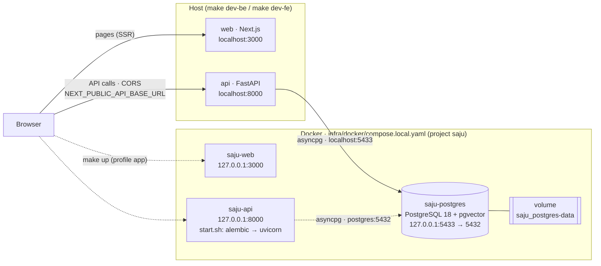
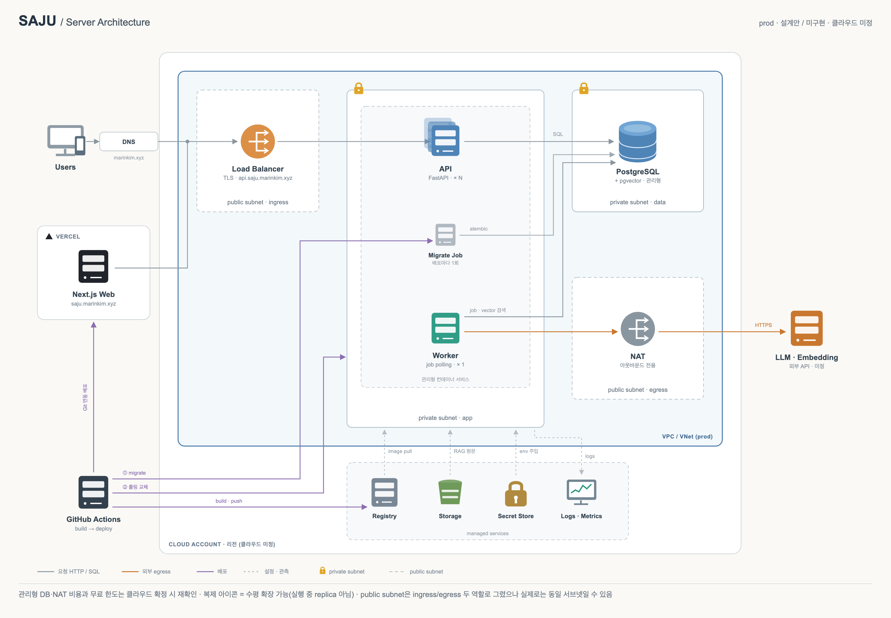
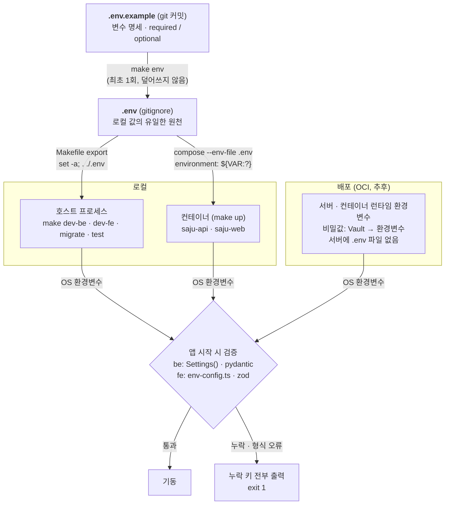

# Service (이름 미정)

FastAPI backend (`be/`) + Next.js frontend (`fe/`) + PostgreSQL, orchestrated
with Docker Compose. See `AGENTS.md` for project conventions and routing.

## Local architecture



- 실선: 평소 개발 — `make db` 로 postgres만 컨테이너, api·web은 호스트 프로세스.
- 점선: 통합 확인 — `make up` 으로 api·web도 컨테이너(profile `app`). 같은 3000/8000 포트를 쓰므로 둘 중 하나만 띄운다.
- `make down` 은 api·web만 내리고 postgres는 유지한다.

## Deployment architecture (설계안)



prod 단일 · fe는 Vercel · be(api·worker·migrate)는 관리형 컨테이너 · 관리형 PostgreSQL + pgvector · 서비스명·도메인·클라우드 미정.
네트워크 규칙, 클라우드별 대응, 배포 흐름은 [`docs/infra-architecture.md`](docs/infra-architecture.md)를 본다.

## Environment variables



> fe 예외: `NEXT_PUBLIC_*`는 빌드 시 JS 번들에 박힌다 → docker build arg로 전달하고 빌드 단계에서 검증한다.

- 변수 추가·변경은 `.env.example`에 먼저 적는다 (`# required` / `# optional (default: X)`).
- 앱은 `.env`를 직접 읽지 않는다. 필수 값이 없으면 기동하지 않는다.
- 자세한 규칙과 검증 지점: [`docs/env.md`](docs/env.md)

## Quick start

```sh
make env         # create .env from .env.example (see docs/env.md)

make db          # start postgres only (127.0.0.1:5433)
make migrate     # apply backend migrations
make dev-be      # run the backend locally (127.0.0.1:8000)
make dev-fe      # run the frontend locally (127.0.0.1:3000), in another shell
```

Or run everything in containers:

```sh
make up          # build + start api, web, postgres
make down        # stop api+web (postgres keeps running)
```

## Checks

```sh
make lint
make test
make fmt
```

See `be/README.md` and `fe/README.md` for per-app details.
