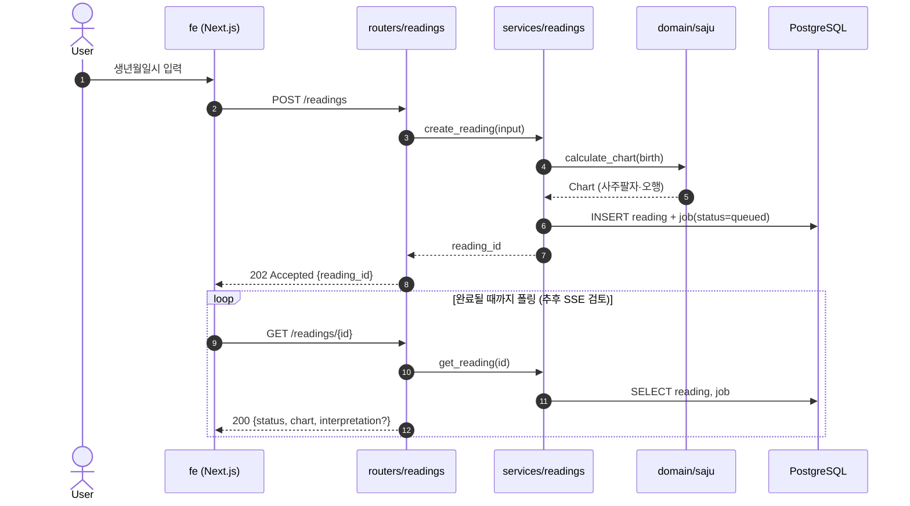
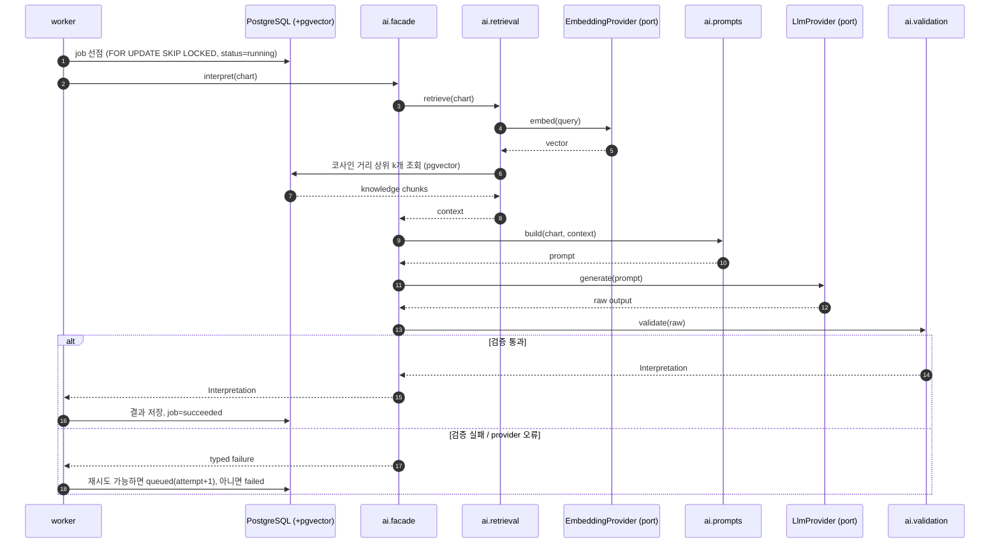
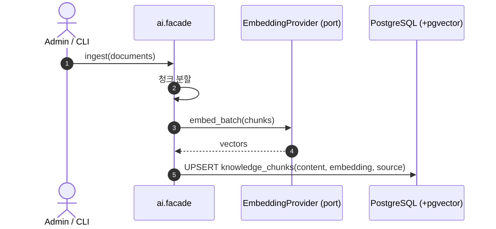

# AI 모듈 설계 (초안)

Status: 제안 · 2026-09-25

AI 실행은 별도 앱이 아니라 `be/` 안의 모듈(`be/src/app/ai/`)로 둔다. 나중에 독립 앱으로
떼어낼 수 있도록 경계를 긋는다.

## 경계 규칙

- be의 다른 코드는 `app.ai`의 공개 진입점(`app.ai.facade`)만 호출한다. 내부 모듈 직접 import는
  ruff 규칙으로 막는다.
- port(치환 인터페이스)는 실제로 교체 대상이 있는 경계에만 둔다: **LLM provider**, **Embedding
  provider**. DB 접근은 repository 직선이다.
- LLM 호출은 요청 경로에서 하지 않는다. 요청은 job을 만들고 즉시 응답하며, worker가 실행한다.
- worker는 같은 코드베이스의 별도 프로세스다. 큐는 Postgres job 테이블(`FOR UPDATE SKIP LOCKED`)로
  시작한다. Redis 등은 필요해질 때 도입한다.
- 사주 계산(`app.domain.saju`)은 DB·LLM 없는 순수 함수다. AI는 계산 결과를 입력으로 받을 뿐 계산하지
  않는다.

## 예상 폴더

```text
be/src/app/
├── domain/saju/            # 만세력·명식 계산 (순수 함수)
├── routers/readings.py     # HTTP 입력·응답
├── services/readings.py    # 명식 계산 → job 생성 (트랜잭션 소유)
├── repositories/           # readings, jobs, knowledge(pgvector)
├── worker.py               # job 폴링 → ai.facade 호출
└── ai/
    ├── facade.py           # 공개 진입점: interpret(), ingest()
    ├── ports.py            # LlmProvider, EmbeddingProvider (Protocol)
    ├── providers/          # anthropic.py, openai.py ... (port 구현)
    ├── retrieval.py        # 질의 임베딩 → 유사 청크 검색
    ├── prompts/            # 프롬프트 템플릿
    └── validation.py       # LLM 출력 스키마 검증
```

## 흐름 1 — 사주 해석 요청 (비동기)



## 흐름 2 — worker의 AI 실행 (RAG)



## 흐름 3 — 지식 적재 (RAG 인덱싱)



## 미정

- LLM / Embedding provider 선택과 임베딩 차원
- 결과 전달: 폴링 → SSE 전환 시점
- 지식 원천(고전 문헌, 자체 해설 등)과 적재 방식(CLI vs 관리자 화면)
- 재시도 횟수·타임아웃 예산
