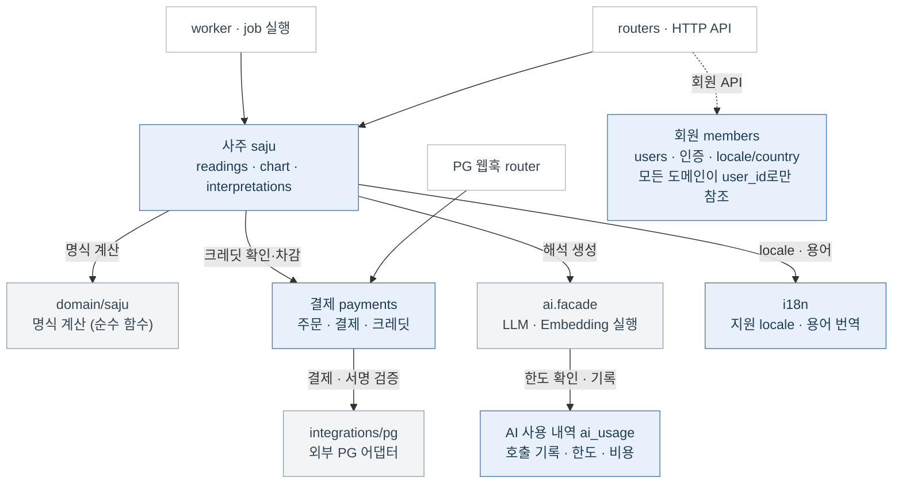

# 도메인 경계와 의존성 (초안)

Status: 제안 · 2026-09-25

be의 업무 도메인은 다섯 개다: 회원, 결제, 사주, i18n, AI 사용 내역. `ai/`는 도메인이 아니라 LLM 실행
인프라이고, 외부 PG는 `integrations/pg/` 어댑터 뒤에 둔다. 폴더는 현재 구조(역할 폴더 + 도메인 파일)를 유지한다.

## 의존 방향

- 파란 상자는 도메인, 회색 상자는 인프라·순수 로직이다.
- 실선은 호출 방향이다. 호출은 위에서 아래로만 흐르고 역방향은 금지한다 (예: 결제가 사주를 호출하지 않는다).
- routers는 사주 외에도 회원·결제·i18n의 service를 직접 호출한다 (그림에서는 결제·i18n 화살표를 생략했다).
- 회원은 모든 도메인이 `user_id`로만 참조한다. 회원 도메인의 테이블·repository를 직접 읽지 않는다.
- 도메인끼리는 상대 도메인 service의 공개 함수로만 호출한다.
- `ai.facade`는 사주에서만 호출한다. 호출마다 `ai_usage`로 한도를 확인하고 결과를 기록한다.
- 외부 PG는 `integrations/pg/` 포트 뒤에 둔다. PG를 바꿔도 결제 도메인은 바뀌지 않는다.
