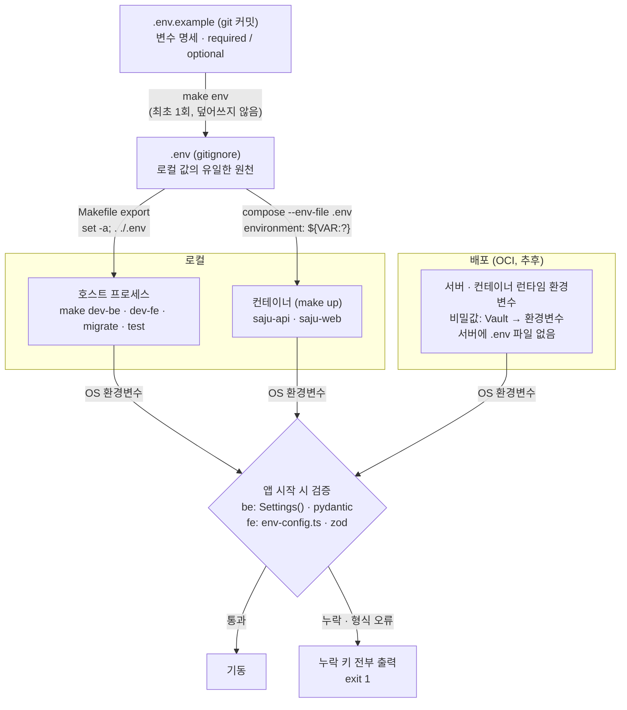

# 환경변수

원칙: 앱은 OS 환경변수만 읽는다 — `.env` 파일을 직접 읽지 않는다. 로컬 값은
루트 `.env` 하나(gitignored)에서 오고, 배포 값은 서버 런타임 환경(추후 OCI)에서
온다.

## 스펙과 흐름

`.env.example`(루트, 커밋됨)이 유일한 스펙이다. 각 키에 `# required` 또는
`# optional (default: X)` 주석이 붙는다. `be/.env.example`, `fe/.env.example`은
없다 — 모두 루트로 병합됐다.

## 사용법

- 최초 1회: `make env` — `.env.example`을 `.env`로 복사한다(이미 있으면 건드리지
  않는다).
- `make dev-be` / `make dev-fe` / `make migrate` / `make test`는 `.env`를 프로세스
  환경으로 export한 뒤 실행한다. `.env`가 없으면 "copy .env.example to .env"로
  실패한다.
- `make up` / `make db`는 `docker compose --env-file .env`로 같은 `.env`를
  interpolation에 사용한다. 필수 값이 비어 있으면 compose 자체가
  `VAR is required` 로 실패한다.
- `make lint` / `make fmt`는 `.env`와 무관하다.

## 검증 지점

- 백엔드: `be/src/app/core/settings.py`의 `Settings`(pydantic-settings,
  `env_file` 없음)가 필수 키 누락/오류 시 `ValidationError`를 던지고,
  `run.py`/`migrations/env.py`가 이를 받아 누락된 키를 모두 나열한 뒤 exit 1
  한다.
- 프론트엔드: `fe/src/common/constants/env-config.ts`의 zod 스키마가
  `next.config.ts` import 시점(빌드)과 `instrumentation.ts`의 `register()`
  (서버 기동) 양쪽에서 검증한다. `NEXT_PUBLIC_*`는 빌드 시 Docker build arg로
  박히므로 빌드 타임 검증이, 나머지 서버 전용 값은 서버 기동 시 검증이
  기준이다.
