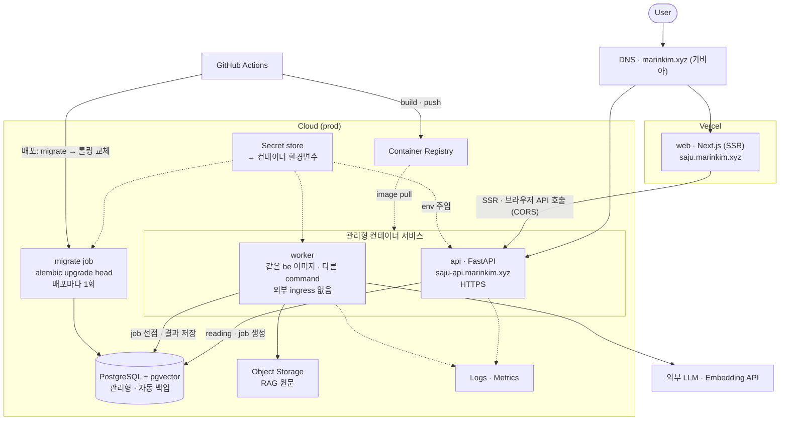
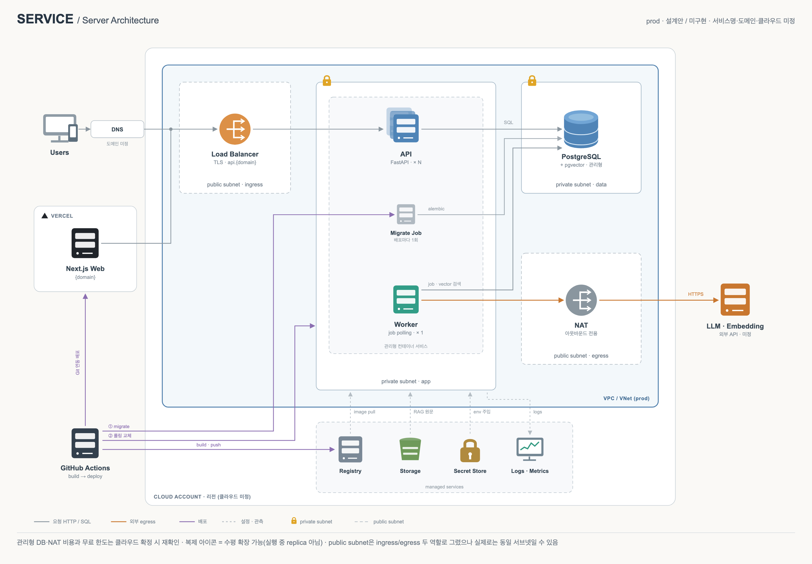
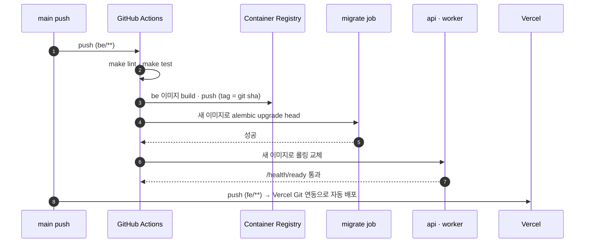

# 배포 아키텍처 (클라우드 중립)

Status: 제안 · 2026-09-25

클라우드와 무관한 논리 구조를 먼저 정한다. 각 구성요소는 아래 대응표로 클라우드별 서비스에
매핑한다. 이 규모에서는 클라우드마다 구조 차이가 거의 없다.

## 전제

- 환경: `prod` 하나
- fe: Vercel
- be: 관리형 컨테이너 서비스 (VM·Kubernetes 아님)
- DB: 관리형 PostgreSQL + pgvector. 컨테이너 안에 DB를 두지 않는다 (컨테이너 디스크는 휘발성)
- 비용: 가능한 한 무료 한도 안에서 운영
- 도메인: fe `saju.marinkim.xyz` (Vercel), api `saju-api.marinkim.xyz` (OCI 서버 nginx). 서비스명은 미정

## 논리 구조

### 구성요소 책임

| 구성요소 | 책임 | 비고 |
| --- | --- | --- |
| web | 화면·SSR. Vercel이 빌드·배포 | `NEXT_PUBLIC_API_BASE_URL`은 Vercel 빌드 환경변수 |
| api | HTTP API. LLM을 직접 호출하지 않음 | 최소 1개 인스턴스 (콜드스타트 허용 여부는 비용과 함께 결정) |
| worker | job 실행 (RAG · LLM 호출) | ingress 없음. 폴링 방식이라 상시 1개 필요 |
| migrate job | 스키마 마이그레이션 | 앱 기동과 분리. 배포 파이프라인에서 api 교체 전에 실행 |
| DB | 원장 + 벡터 검색 | pgvector 지원 필수. 컨테이너에 두지 않음 |
| Secret store | DB 비밀번호, LLM API 키 | 앱은 환경변수만 읽음 ([env.md](env.md)) |
| Object Storage | RAG 원문 문서 | 임베딩 결과는 DB에 저장 |

## 네트워크

> 설계안 · 미구현. 클라우드 미정이라 아이콘은 모두 일반화된 심볼이며 특정 클라우드 제품을
> 가리키지 않는다. 전체 배치도(HTML/SVG 원본): [server-architecture.html](server-architecture.html)

| 서브넷 | 구성요소 | 인바운드 | 아웃바운드 |
| --- | --- | --- | --- |
| Public subnet | Load Balancer / Ingress, NAT Gateway | 인터넷 → 443(TLS) | LB → private·app; NAT → 인터넷(egress 중계) |
| Private subnet · app | api, worker, migrate job | LB에서만(api) · 외부 ingress 없음(worker·migrate) | DB로 SQL, NAT 경유 외부 LLM API 호출 |
| Private subnet · data | PostgreSQL + pgvector | api·worker·migrate에서만(같은 VPC 내부) | 없음 (public 없음) |

- private 서브넷은 LB를 통해서만 외부에서 도달 가능하다. api·worker·migrate에는 직접 ingress가 없다.
- DB는 public endpoint를 두지 않는다. private endpoint로만 연결한다.
- private 앱 서브넷의 아웃바운드(LLM API 호출 등)는 NAT를 통해서만 나간다.
- 배치도에서는 Load Balancer(ingress)와 NAT(egress)를 이해를 돕기 위해 별도 박스로 그렸다. 위
  표처럼 실제로는 하나의 public subnet일 수 있다(클라우드 확정 시 결정).
- NAT Gateway는 대체로 무료가 아니다(시간당 과금 + 처리 데이터 과금). 클라우드를 확정할 때 비용을
  다시 확인한다. 무료 한도를 우선한다면 대안으로 api·worker를 public subnet에 두고
  보안 그룹(inbound 제한)으로 격리하는 방식을 검토한다 — NAT 비용은 없지만 서브넷 격리 수준이 낮아진다.

## 배포 흐름

- 클라우드 인증은 GitHub OIDC로 한다. 장기 액세스 키를 GitHub Secrets에 두지 않는다.
- 서버·nginx·인증서는 `Dae-Jeong/MarinInfra`(private)가, 앱의 운영 compose·배포 스크립트는 이 레포 `infra/`가 관리한다.

## 클라우드별 대응

| 논리 구성요소 | AWS | Azure | GCP | OCI |
| --- | --- | --- | --- | --- |
| api (컨테이너 서비스) | ECS Fargate + ALB | App Service (Linux 컨테이너) | Cloud Run service | Container Instances + LB |
| worker (상시 컨테이너) | ECS Fargate service | App Service (별도 앱) 또는 WebJob | Cloud Run (min-instances 1) 또는 worker pool | Container Instances |
| migrate job | ECS RunTask | App Service 배포 슬롯 전 단계 / Container Apps Job | Cloud Run job | Container Instances (1회 실행) |
| PostgreSQL + pgvector | RDS for PostgreSQL | Azure Database for PostgreSQL Flexible Server | Cloud SQL for PostgreSQL | OCI Database with PostgreSQL |
| Secret store | Secrets Manager | Key Vault | Secret Manager | Vault |
| Container Registry | ECR | ACR | Artifact Registry | OCIR |
| Object Storage | S3 | Blob Storage | Cloud Storage | Object Storage |
| Logs · Metrics | CloudWatch | Azure Monitor | Cloud Logging · Monitoring | Logging · Monitoring |
| TLS · 도메인 | ACM + ALB | App Service 관리형 인증서 | Cloud Run 도메인 매핑 | LB 인증서 |
| Terraform state | S3 | Storage Account | GCS | Object Storage |
| VPC / VNet | VPC | VNet | VPC | VCN |
| NAT | NAT Gateway | NAT Gateway | Cloud NAT | NAT Gateway |
| Load Balancer | ALB | App Service 내장 or Application Gateway | Cloud Run 내장 or HTTPS LB | Load Balancer |

> 관리형 DB의 pgvector 지원·무료 한도·가격은 자주 바뀐다. 클라우드를 확정할 때 공식 문서로 다시
> 확인하고 출처와 확인 날짜를 남긴다. 무료 한도 안에서 DB 비용이 부담되면 외부 관리형
> Postgres(예: Neon)를 대안으로 검토한다.

## 도메인

| 호스트 | 대상 |
| --- | --- |
| `saju.marinkim.xyz` | Vercel (web) · 가비아 CNAME |
| `saju-api.marinkim.xyz` | OCI 서버 nginx → api · 가비아 A 168.110.100.93 |

## 미정

- 클라우드 선택 (AWS / Azure / GCP / OCI)
- NAT·서브넷 구성 (비용)
- api 최소 인스턴스 수 (콜드스타트 허용 여부)
- worker 트리거: 상시 폴링 유지 vs 큐 push 방식 (scale-to-zero 플랫폼이면 push가 유리)
- DB: 클라우드 관리형 vs 외부 관리형 (무료 한도 비교 후 결정)
- 모니터링·알림 수준
