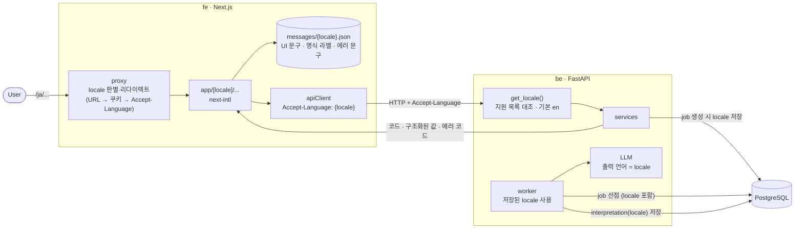
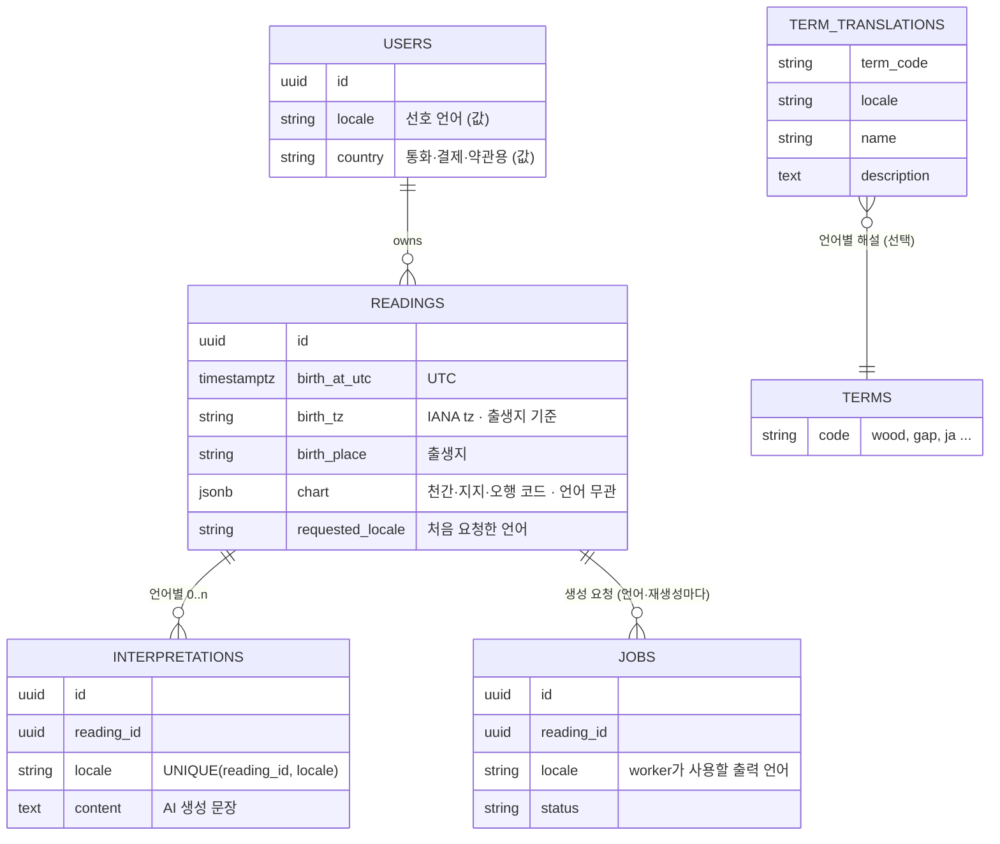
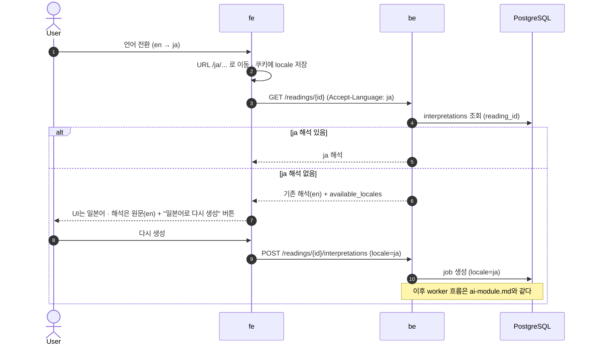

# 다국어 (i18n) 설계

Status: 제안 · 2026-09-25

해외 사용자를 대상으로 하므로 프로젝트 전체를 글로벌 기준으로 설계한다.

## 결정

- **URL은 언어만 나눈다.** 기본 언어(en)는 접두사 없이 `/`, 나머지는 `/ja/...` (`next-intl`, `localePrefix: 'as-needed'`).
- **국가는 URL에 넣지 않는다.** 값(IP 추정 + 사용자 설정)으로 관리하고 통화·결제·약관 선택에만 쓴다.
- **국적은 쓰지 않는다.** 사주 계산에 필요한 것은 출생지의 시간대다.
- **be는 코드와 구조화된 값을 반환한다.** 사람이 읽는 문장은 fe가 번역한다. 예외는 AI가 만든 문장이며
  `locale`과 함께 저장한다.
- **언어를 바꿔도 기존 해석은 원래 언어로 보여주고 "다시 생성"을 제공한다** (자동 재생성·번역은 나중에).
- 지원 언어: `en`(기본), `ja`. 추가는 locale 목록과 번역 파일만 늘린다.

## locale 흐름

- 동기 요청은 `Accept-Language` 헤더로 locale을 받는다.
- worker는 요청 밖에서 돌기 때문에 job을 만들 때 locale을 DB에 저장하고, worker는 그 값을 쓴다.
- be 응답의 에러는 코드만 담는다. fe가 `messages/{locale}.json`에서 문구를 찾는다.

## 데이터 모델 — 언어 의존 여부

| 데이터 | 언어 의존 | 저장 방식 |
| --- | --- | --- |
| 출생 정보 · 명식 | 없음 | 코드와 UTC·IANA tz로 저장. 화면 이름은 fe 번역 파일 |
| AI 해석 | 있음 | `interpretations`에 `locale`과 함께 저장. 한 명식에 언어별 여러 행 가능 |
| 용어 해설 | 있음 | 짧은 라벨은 fe 번역 파일. 운영 중 수정이 필요한 긴 해설만 `term_translations` |
| RAG 원문 | 한국어 하나 | 복제하지 않는다. 다국어 임베딩으로 검색하고 생성 시 출력 언어를 지시 |
| 에러 | 없음 | be는 코드만, 문구는 fe |

## 언어 변경 시 (C안)

## 미정

- 출생지 입력 방식 (도시 검색 + 지오코딩 vs 시간대 직접 선택)
- 진태양시 보정 적용 여부
- 번역 파일 관리 방식 (직접 관리 vs 번역 관리 도구)
- 기획 SSOT에 이 결정들을 옮기는 시점
