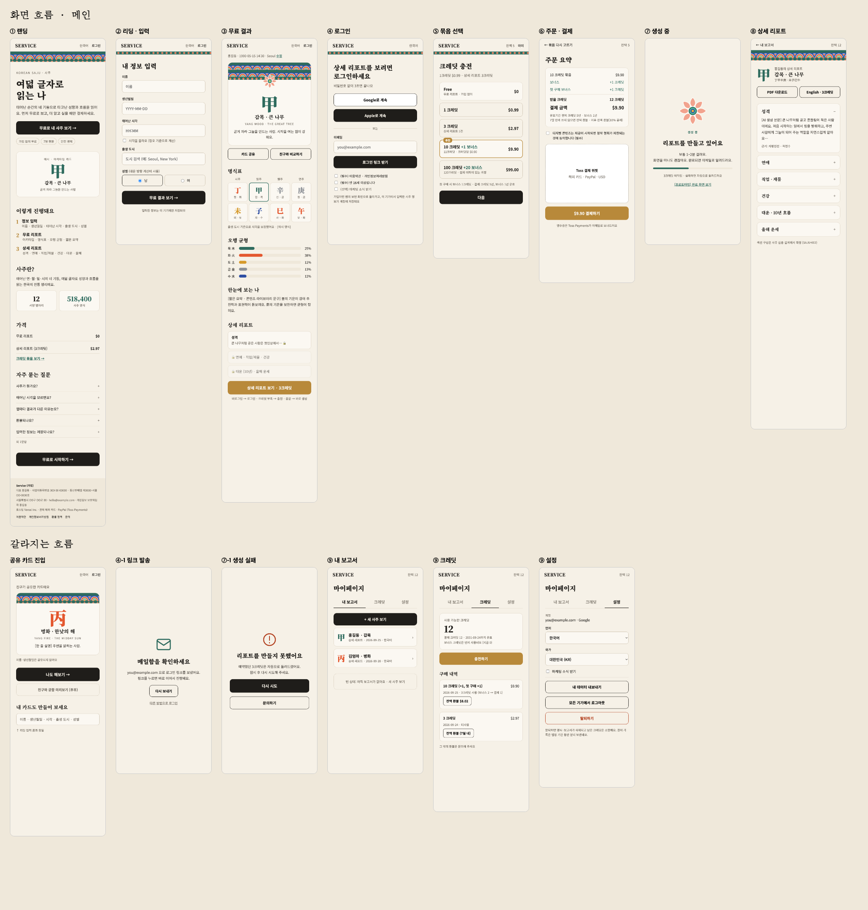

# 화면 흐름과 와이어프레임

Status: 제안 · 브랜드 A(한지 + 조선 단청) 적용 · 기준: [정책 plan-v0.1.0](../policies/README.md), [사이트맵](sitemap.md)

작업 캔버스(Claude Design): https://claude.ai/artifact/EGfrUFbA5sSTXkarS3iijV — 비공개, 공유는 캔버스의 Share 메뉴에서.
레포에는 확정본의 원본(`docs/design/wireframes/*.dc.html`)과 이미지만 남긴다.

## 고객 흐름

- 실선: 메인 흐름 · 금색: 조건 분기 · 점선: 갈라지는 흐름
- 무료 결과(③)의 "상세 보기"는 상태에 따라 세 갈래로 나뉜다.

  | 상태 | 이동 |
  | --- | --- |
  | 비로그인 | ④ 로그인 → ⑤ 묶음 선택 |
  | 로그인 · 크레딧 부족 | ⑤ 묶음 선택 (충전) |
  | 로그인 · 크레딧 충분 | "3크레딧 사용" 확인 → ⑦ 생성 중 |

## 화면

| # | 화면 | 경로 | 주요 정책 |
| --- | --- | --- | --- |
| ① | 랜딩 | `/` | I18N-006, PAY-008 |
| ② | 리딩 · 입력 | `/reading` | MEM-003 |
| ③ | 무료 결과 | `/reading` | SAJU-001, PAY-005 |
| ④ | 로그인 | `/login` | MEM-004, MEM-006, MEM-007 |
| ⑤ | 묶음 선택 | `/pricing` | PAY-001~003, PAY-008 |
| ⑥ | 주문 요약 · 결제 | `/pricing` | PAY-012, PAY-021, PAY-040 |
| ⑦ | 생성 중 | `/reports/:id` | AIU-003, AIU-005, PAY-020 |
| ⑧ | 상세 리포트 | `/reports/:id` | SAJU-002(보류), I18N-004 |
| — | 공유 카드 진입 | `/s/:code` → `/reading` | MEM-003 |
| ④-1 | 이메일 링크 발송 | `/login` | MEM-004 |
| ⑦-1 | 생성 실패 | `/reports/:id` | AIU-005, PAY-042 |
| ⑨ | 마이페이지 (내 보고서 · 크레딧 · 설정) | `/my` | MEM-008, PAY-021, PAY-040~041 |

개별 화면 이미지: [`images/screens/`](images/screens/) · 브랜드 기준: [`../design/brand-a.html`](../design/brand-a.html)

## 표시 규칙

- 사업자 정보·이름·날짜·명식은 예시 또는 임시값이다 ([content.md](content.md)).
- 명식표의 글자는 오행 색(목 석록 · 화 주홍 · 토 황토 · 금 은회 · 수 군청)으로 칠한다.
- 단청은 화면 머리(휘 띠 + 점 띠)와 카드 머리(머리초)에만 쓰고, 본문·폼·결제 영역은 한지 바탕으로 비운다.
