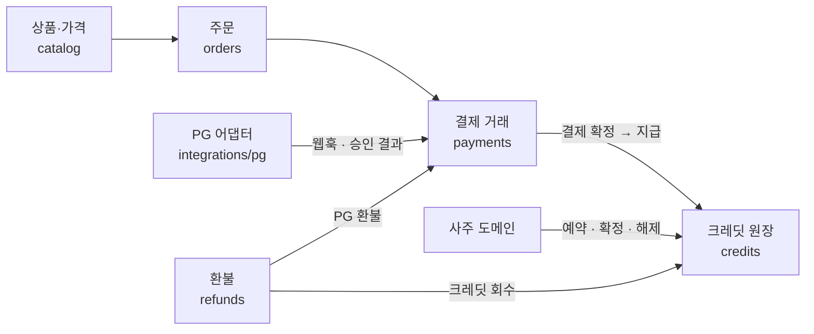

# 결제 정책 (payments)

Status: 논의 중 · 항목별로 합의하면 `상태: 합의`로 바꾼다.

PG는 Toss Payments(USD MID: 해외 카드 + PayPal), 판매 방식은 크레딧이다.

## 하위 모듈

| 하위 모듈 | 책임 | 핵심 불변 규칙 |
| --- | --- | --- |
| 상품·가격 | 무엇을 얼마에 파는가 | 주문 시점 가격을 주문에 복사한다. 가격표가 바뀌어도 과거 주문은 변하지 않는다 |
| 주문 | 누가 무엇을 사려는가 | 상태는 한 방향으로만 이동한다 |
| 결제 거래 | PG와 오간 돈의 기록 | PG 결제 ID당 한 번만 처리한다. 금액은 주문 금액과 일치해야 한다 |
| 크레딧 원장 | 사용할 수 있는 크레딧 | 추가만 한다. 잔액 = 원장 합계. 차지백 외에는 음수가 될 수 없다 |
| 환불 | 돌려주는 판단과 기록 | 환불액 ≤ 결제액. 환불하면 크레딧 회수 기록이 함께 남는다 |
| PG 어댑터 | Toss와의 통신 | 도메인 규칙을 모른다. 형식 변환만 한다 |

## 상품·가격 (catalog)

### PAY-001 크레딧 단위
- 상태: 합의
- 규칙: 크레딧은 화폐 단위다. 상품 가격은 크레딧 수로 매긴다.
- 파라미터: `credit.unit_price_usd` = 0.99
- 적용 지점: catalog
- 사용자 고지: "1 credit = $0.99"

### PAY-002 크레딧 묶음
- 상태: 합의
- 규칙: 묶음은 1 · 3 · 10 · 100크레딧 네 가지. 큰 묶음일수록 보너스 비율을 키운다. 할인 대신 보너스로 운영해 가격표를 $0.99 배수로 유지한다.
- 파라미터: `credit.packs`

  | 묶음 | 결제액 | 보너스 | 받는 크레딧 | 크레딧당 |
  | --- | --- | --- | --- | --- |
  | 1 | $0.99 | — | 1 | $0.99 |
  | 3 | $2.97 | — | 3 | $0.99 |
  | 10 | $9.90 | +1 (10%) | 11 | $0.90 |
  | 100 | $99.00 | +20 (20%) | 120 | $0.83 |

- 안전장치: 100크레딧 묶음은 **이전 결제 이력이 있는 계정만** 구매할 수 있다 (첫 결제부터 고액을 결제하는 부정 결제 방지).
- 적용 지점: catalog → orders
- 사용자 고지: 묶음별 받는 크레딧 수(보너스 포함)를 결제 전에 표시
- 근거: 묶음이 클수록 보너스를 주는 운세·크레딧 앱 공통 패턴. 큰 묶음은 중간 묶음(10)을 적정가로 보이게 하는 기준점 역할도 한다.

### PAY-003 첫 구매 보너스
- 상태: 합의
- 규칙: 계정의 첫 결제 완료 시 묶음과 관계없이 보너스 크레딧을 1회 지급한다.
- 파라미터: `credit.first_purchase_bonus` = 1
- 적용 지점: payments(결제 확정) → credits(지급, 사유: 첫 구매 보너스)
- 근거: 첫 구매 보너스는 운세 상담 앱(Purple Garden 등)의 대표 유입 장치

### PAY-004 보너스 크레딧 규칙
- 상태: 합의
- 규칙: 보너스 크레딧은 환불하지 않는다. 사용 시 보너스 크레딧을 먼저 차감한다. 환불 시 해당 묶음의 보너스를 먼저 회수한다.
- 적용 지점: credits

### PAY-005 상품별 크레딧 가격
- 상태: 합의
- 규칙: 상세 리포트 = 3크레딧($2.97). 이후 상품은 크레딧 수로 추가한다.
- 파라미터: `product.detailed_report.credits` = 3
- 참고: 10크레딧 묶음(+1) + 첫 구매 보너스(+1) = 12크레딧 = 상세 리포트 4건

### PAY-006 주문 시점 가격 고정
- 상태: 합의
- 규칙: 주문 생성 시 묶음 가격과 크레딧 수를 주문에 복사한다. 이후 가격표가 바뀌어도 과거 주문·영수증·환불 금액은 변하지 않는다.
- 적용 지점: orders

### PAY-007 표시·청구 통화
- 상태: 합의
- 규칙: USD 단일 가격. 현지 통화 환산 금액은 표시하지 않는다 (카드사가 환산).
- 근거: Toss Payments 해외 결제는 KRW·USD·JPY, PayPal은 USD만 지원. EUR·GBP 청구 불가.

### PAY-008 판매 페이지 구성
- 상태: 합의
- 규칙: 판매 페이지는 5단 구성이다: **Free**(무료 짧은 리포트, 가입 없이) · 1 · 3 · 10 · 100크레딧.
  10크레딧 묶음을 추천(강조) 묶음으로 표시한다.
- 적용 지점: fe 판매 페이지 (catalog 데이터로 렌더링)

## 주문 (orders)

### PAY-010 주문 상태와 만료
- 상태: 합의
- 규칙: 생성 → 결제 완료 → (부분 환불) → 환불 완료. 결제하지 않은 주문은 만료, PG 승인 거절은 실패. 상태는 한 방향으로만 이동한다.
- 파라미터: `order.expire_minutes` = 30
- 적용 지점: orders (만료는 주기 작업)

### PAY-011 주문 하나 = 묶음 하나
- 상태: 합의
- 규칙: 장바구니 없음. 주문 하나에 크레딧 묶음 하나만 담는다.

### PAY-012 결제 페이지 구성
- 상태: 합의
- 규칙: 우리 결제 페이지 안에 Toss 결제 위젯을 넣는다. 위젯 위에 우리가 주문 요약을 보여준다:
  받을 크레딧(보너스 포함) · 결제 금액(USD) · 크레딧 유효기간 · 환불 규칙 요약 · 디지털 콘텐츠 청약 철회 제한 동의.
  결제 수단 선택과 카드 입력은 Toss 위젯이 맡는다.
- 적용 지점: fe 결제 페이지 + orders

### PAY-013 영수증
- 상태: 합의
- 규칙: 영수증은 Toss Payments가 발송하는 것을 그대로 쓴다. 우리는 계정 화면에 구매 내역만 보여준다.

## 결제 거래 (payments)

Toss 결제 흐름: 결제창(위젯)은 **인증까지만** 한다. 성공하면 `successUrl`로 돌아오고, 우리 서버가 금액을 검증한 뒤
**결제 승인 API**를 호출해야 결제가 완료된다. 실패하면 `failUrl`로 에러 코드·메시지와 함께 돌아온다
([토스페이먼츠 결제위젯 연동](https://docs.tosspayments.com/guides/v2/payment-widget/integration)).

### PAY-030 결제 확정 기준
- 상태: 합의
- 규칙: `successUrl` 도착만으로는 확정하지 않는다. 서버가 금액 검증 → 승인 API 호출 성공 시 확정하고 크레딧을 지급한다. 웹훅도 같은 확정 경로로 처리한다.

### PAY-031 중복 처리 방지
- 상태: 합의
- 규칙: Toss 결제 키(paymentKey) 하나당 한 번만 확정한다. 승인 응답과 웹훅이 모두 와도 크레딧은 한 번만 지급된다.

### PAY-032 금액 검증
- 상태: 합의
- 규칙: `successUrl`로 돌아온 금액과 주문 금액이 다르면 승인하지 않는다. 승인 후 금액이 다르면 크레딧을 지급하지 않고 보류한 뒤 확인한다.

### PAY-033 상태 동기화
- 상태: 합의
- 규칙: 결제 후 일정 시간 안에 확정되지 않은 주문은 Toss에 결제 상태를 직접 조회해 맞춘다. 추가로 하루 1회 Toss 정산 내역과 우리 결제 기록을 대사한다.
- 파라미터: `payment.sync_after_minutes` = 5, `payment.reconcile_cron` = 매일 1회

### PAY-034 결제 실패 처리
- 상태: 합의
- 규칙: 결제창 안의 오류(카드 인증 등)는 Toss·카드사 화면이 보여준다. 결제창을 벗어난 뒤의 실패는 우리 `failUrl` 페이지에서 에러 코드별로 안내한다.

  | 코드 | 상황 | 안내 |
  | --- | --- | --- |
  | `PAY_PROCESS_CANCELED` | 사용자가 결제창을 닫음 | 조용히 결제 페이지로 복귀 (주문 ID가 전달되지 않으므로 세션의 주문으로 복원) |
  | `REJECT_CARD_COMPANY` | 카드사 거절 (한도·비밀번호 등) | 사유 안내 + 다른 카드나 PayPal로 다시 시도 |
  | `PAY_PROCESS_ABORTED` | 인증 실패 등 결제 중단 | 다시 시도 안내, 반복되면 문의 링크 |

- 주문이 만료 전(30분)이면 같은 주문으로 다시 시도한다.

## 크레딧 원장 (credits)

### PAY-020 로트 구조
- 상태: 합의
- 규칙: 크레딧은 **로트**(한 번에 받은 덩어리) 단위로 관리한다. 결제 1건, 보너스 1건이 각각 로트 하나다.
  로트는 종류(결제·보너스·보상), 만료일, 출처(주문 등)를 가진다.
  모든 변화는 원장에 "어느 로트에서 몇 개가 왜"로 한 줄씩 추가만 한다. 로트 잔액 = 해당 로트의 원장 합계.
- 원장 기록 종류: 지급 · 예약 · 확정 · 해제 · 만료 · 환불 회수 · 차지백 회수 · 조정
- 적용 지점: credits

### PAY-021 유효기간
- 상태: 합의
- 규칙: 결제한 크레딧은 지급일로부터 **5년**, 보너스 크레딧은 지급일로부터 **1년**.
- 파라미터: `credit.expiry.paid_years` = 5, `credit.expiry.bonus_years` = 1
- 사용자 고지: 결제 페이지와 계정 화면에 유효기간 표시
- 근거: 한국 선불 재화 관행 (유료 5년은 상사채권 소멸시효, 무상 지급분은 1년 또는 지급 시 정한 기간)

### PAY-022 차감 순서
- 상태: 합의
- 규칙: 보너스 로트부터, 그다음 만료가 빠른 로트부터 차감한다. 한 번의 사용이 여러 로트에 걸칠 수 있다.

### PAY-023 만료 처리
- 상태: 합의
- 규칙: 매일 1회 만료된 로트의 남은 수량에 "만료" 기록을 추가한다. 만료 30일 전에 이메일로 알린다.
- 파라미터: `credit.expiry.notice_days` = 30
- 적용 지점: credits (주기 작업)

## 환불 (refunds)

한국 표준약관의 두 단계 구조를 따른다: **청약 철회**(7일 이내·미사용 → 전액)와 **잔액 환불**(일부 사용 또는 7일 이후 → 남은 결제 크레딧에서 공제 후 환불).
근거: 온라인게임 표준약관(공정거래위원회) — 7일 이내 청약 철회, 사용·일부 소비 시 철회 불가, 캐시 환불 시 남은 금액의 10% 이내 공제.
디지털콘텐츠 표준약관 — 이용자가 얻은 이익에 해당하는 금액을 공제하고 환급.

### PAY-040 청약 철회 (전액 환불)
- 상태: 합의
- 규칙: 결제 후 7일 이내이고 그 주문의 결제 크레딧을 하나도 쓰지 않았으면 전액 환불한다. 그 주문으로 받은 보너스도 회수한다.
- 파라미터: `refund.withdrawal_days` = 7
- 처리: 계정 화면 환불 버튼으로 자동 처리

### PAY-041 잔액 환불 (부분 환불)
- 상태: 합의
- 규칙: 일부를 썼거나 7일이 지났으면, 그 주문 로트에 **남은 결제 크레딧 × 실제 결제 단가**에서 10%를 공제하고 환불한다.
  보너스는 별도 로트이므로 환불 금액에 들어가지 않고 회수만 한다. 유효기간(5년) 안에서만 가능하다.
- 파라미터: `refund.balance_fee_rate` = 0.10
- 예: 10크레딧 묶음($9.90, 보너스 1은 별도 로트)에서 결제 크레딧 4개를 썼다 → 남은 6 × $0.99 = $5.94 → 10% 공제 → $5.35 환불, 보너스 로트 회수
- 처리: 계정 화면 환불 버튼으로 자동 처리
- 근거: 온라인게임 표준약관의 잔액 10% 이내 공제. 보너스를 별도 로트로 두었기 때문에 결제 단가는 항상 $0.99이고, 묶음 할인분을 따로 계산할 필요가 없다.

### PAY-042 생성 실패
- 상태: 합의
- 규칙: 환불 대상이 아니다. 예약한 크레딧을 자동으로 복구한다 (PAY-020 해제 기록).

### PAY-043 품질 불만·기타
- 상태: 합의
- 규칙: 자동 환불 조건에 맞지 않는 요청은 문의로 받는다. 품질 불만은 검토 후 크레딧으로 보상할 수 있다 (보상 로트, 유효기간 1년).

### PAY-044 차지백
- 상태: 합의
- 규칙: 카드사 분쟁이 접수되면 해당 주문 로트의 남은 크레딧을 회수한다. 잔액이 음수가 되면 새 생성을 막는다.

### PAY-045 환불 방법
- 상태: 합의
- 규칙: 원래 결제 수단으로 Toss 결제 취소 API를 통해 환불한다 (부분 환불은 취소 금액 지정).
  환불 금액 ≤ 결제 금액. 환불 기록과 크레딧 회수 기록을 항상 함께 남긴다.
- 확인 필요: 해외 카드·PayPal 결제의 부분 취소 지원 범위
