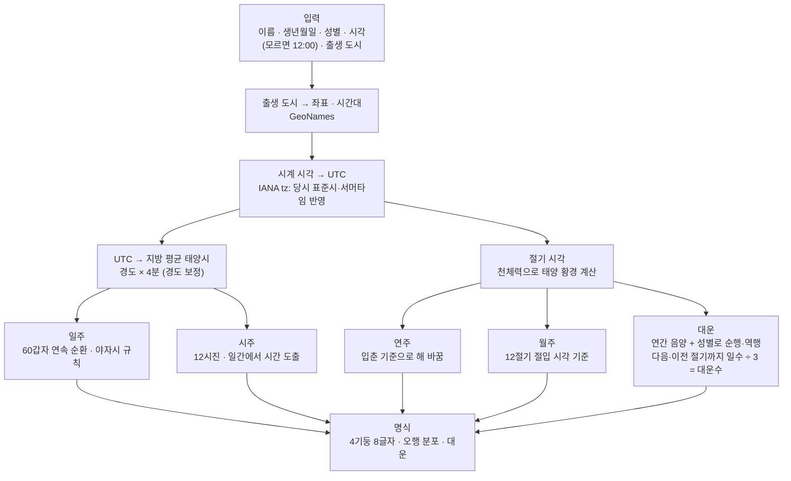

# 사주 정책 (saju)

Status: 보류 · 다른 도메인은 사주를 **보고서(Report)** 로 추상화해서 본다. 사주 고유 설계는 별도로 깊게 진행한다.
계산 기준은 아래 "계산 방법론" 절이 소유한다.

## 다른 도메인이 보는 보고서 인터페이스

| 속성 | 내용 |
| --- | --- |
| 종류 | `free` \| `detailed` (이후 궁합·연간 운세 등 추가) |
| 입력 | 명식 참조 (내용은 사주 도메인만 안다) |
| 언어 | `locale` (BCP 47) |
| 상태 | 생성 중 → 완료 \| 실패 |
| 가격 | 종류별 크레딧 수 (PAY-005, 상세 = 3) |
| 생성 방식 | 콘텐츠 조합(무료) \| AI 생성(유료) |

### SAJU-001 무료 결과는 콘텐츠 라이브러리 조합
- 상태: 합의
- 규칙: 무료 결과는 실행 시 AI를 쓰지 않는다. 미리 만든 콘텐츠 라이브러리(일간·오행 특징 등 명식 코드로 조회)를 조합하고,
  이름·수치 같은 템플릿 변수만 채운다. 콘텐츠는 AI로 초안을 만든 뒤 검수해서 언어별로 관리한다.
- 효과: 무료 사용자의 LLM 비용 0, 같은 입력이면 같은 결과, 아키타입 공유 이미지는 일간 10종을 미리 만들어 CDN에 둔다.

## 보류 항목 (사주 심층 설계에서 결정)

- SAJU-002 상세 보고서 섹션 구성
- SAJU-003 결제 직후 자동 생성 여부
- SAJU-004 같은 명식 재사용 (같은 사용자·같은 보고서는 재사용 — PAY·AIU-003에 반영됨)
- SAJU-005 공유 범위 (명식 코드만, 개인정보 없음 — MEM-003에 반영됨)
- SAJU-006 보고서 보관·PDF

## 계산 방법론

모든 계산과 해석은 **동양 사주(자평명리)** 하나를 기준으로 한다. 서양 점성술 개념은 섞지 않는다.
학파마다 갈리는 규칙은 **한국 실무에서 많이 쓰는 방식**을 따른다.

### 결정한 기준

| 항목 | 결정 | 근거 |
| --- | --- | --- |
| 기준 체계 | 자평명리 (4기둥 8글자) | 해외 K-사주 서비스 공통 기준 |
| 시각 보정 | **경도 보정** (지방 평균 태양시). 균시차는 적용하지 않음 | 한국 실무 기본. 서울은 표준시보다 약 32분 늦음 |
| 자시 경계 | **야자시·조자시** 적용. 23~24시는 당일 일주 + 자시, 0~1시부터 다음 날 일주 | 한국 만세력·실무에서 많이 쓰는 방식 |
| 시각 모름 | **정오(12:00) 기준**으로 계산하고 시주를 "추정"으로 표시 | 입력 부담을 줄이고 결과를 항상 제공 |
| 서머타임 | 출생 지역·날짜에 시행된 서머타임을 자동 반영 | 한국도 1948~1960년, 1987~1988년 시행 |
| 성별 | 대운 방향에만 사용 | 자평명리 대운 규칙 |

### 계산 흐름

- 연주·월주 경계(입춘, 12절기)는 **절입 시각을 분 단위로** 비교한다. 절기 경계일에 태어난 사람도 정확하게 나뉜다.
- 절기는 태양 위치로 정해지는 천문 현상이므로 UTC로 계산하고 비교한다. 시각 보정(경도)은 시주·일주 판단에만 쓴다.
- 시각을 모르면 출생지 시계 12:00을 입력값으로 쓰고, 이후 과정은 같다.

### 기본 이론

- **4기둥**: 연주·월주·일주·시주. 각 기둥은 천간 1자 + 지지 1자, 합쳐서 8글자.
- **60갑자**: 천간 10개와 지지 12개의 조합 60개가 순환한다. 일주는 날마다 하나씩 끊김 없이 이어진다.
- **연주**: 1월 1일이나 음력 설날이 아니라 **입춘**에 바뀐다.
- **월주**: 음력 월이 아니라 **12절기**(입춘·경칩·청명 …)에 바뀐다. 월간은 연간에서 정해진다.
- **시주**: 하루를 2시간 단위 12시진으로 나눈다. 시간은 일간에서 정해진다.
- **대운**: 10년 단위 운의 흐름. 양년생 남자·음년생 여자는 순행, 음년생 남자·양년생 여자는 역행한다.
  출생 시점부터 다음(순행) 또는 이전(역행) 절기까지의 일수를 3으로 나눠 대운 시작 나이를 정한다.

### 참고 고전

해석 규칙의 근거와 RAG 원문 후보다.

- 연해자평 (淵海子平)
- 자평진전 (子平眞詮)
- 적천수 (滴天髓)
- 궁통보감 (窮通寶鑑)

### 데이터와 검증

| 영역 | 기준 | 용도 |
| --- | --- | --- |
| 시간대 | IANA tz database | 과거 표준시 변경과 서머타임을 포함해 당시 실제 시각을 UTC로 복원 |
| 출생 도시 | GeoNames 공개 데이터셋 | 도시 → 경도·시간대. 외부 API 없이 DB에 적재 |
| 절기 시각 | 천체력 (태양 황경 15° 간격) | 연주·월주 경계 계산 |
| 검증 | 한국천문연구원 특일 정보(24절기)·음양력 정보 | 계산한 절기·날짜를 공식 데이터와 대조하는 테스트 |

- 계산은 `be/src/app/domain/saju/`의 순수 함수로 구현한다 ([AI 모듈 설계](../architecture/ai-module.md) 참고).
- 검증 테스트는 절기 경계일, 자시(23~01시), 서머타임 시행 기간, 해외 도시 출생 케이스를 반드시 포함한다.

### 사용자에게 알리는 범위

별도 계산 방법 페이지는 두지 않는다. 결과 화면에 필요한 안내만 짧게 표시한다.

- 시각을 모르면: "시주는 정오 기준 추정"
- 출생 도시 기준으로 시각을 보정했다는 한 줄 안내

### 미정

- 한국 외 사용자에게도 야자시를 그대로 적용할지 (중국 명리 주류는 23시 날짜 변경)
- 사용자가 학파 옵션을 바꿀 수 있게 할지 (처음에는 기본값 하나)
