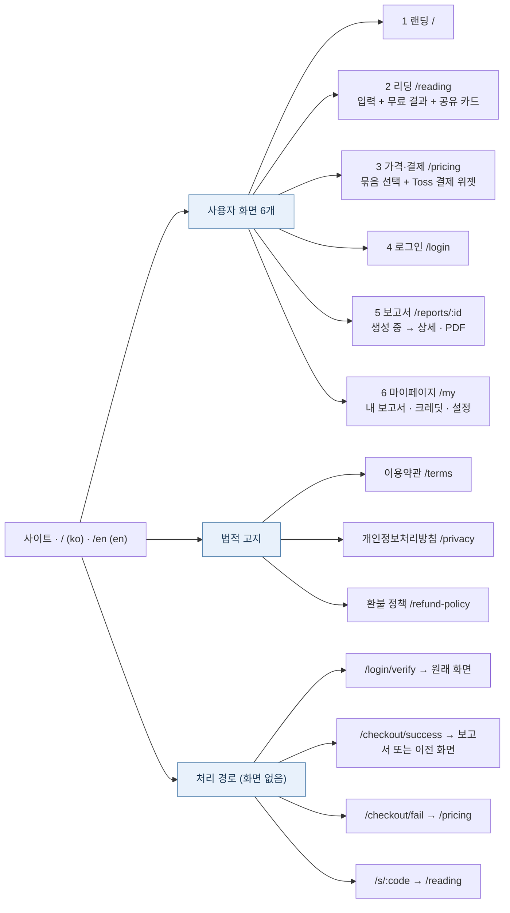

# 사이트맵 (초안)

Status: 제안 · 기준: [정책 v0.1.0](policies/README.md)

경로는 한국어 기준이다. 영어는 같은 경로 앞에 `/en`이 붙는다 (I18N-001). 예: `/pricing` ↔ `/en/pricing`.

페이지 사이의 이동 흐름은 [유저 저니](user-journey.md)를 본다.

## 사용자 화면

| # | 화면 | 경로 | 접근 | 담는 것 | 주요 정책 |
| --- | --- | --- | --- | --- | --- |
| 1 | 랜딩 | `/` | 모두 | 서비스 소개, CTA "시작하기" → `/reading` | I18N-006 |
| 2 | 리딩 | `/reading` | 모두 | 입력 폼 → 같은 화면에 무료 결과 → "상세 보기". 공유 링크로 들어오면 공유 카드 + "나도 해보기" | SAJU-001, MEM-003 |
| 3 | 가격·결제 | `/pricing` | 모두 (결제는 회원) | Free · 1 · 3 · 10★ · 100 선택 → 같은 화면에서 주문 요약 + Toss 결제 위젯 | PAY-008, PAY-010, PAY-012 |
| 4 | 로그인 | `/login` | 비회원 | Google · Apple · 이메일 링크, 약관 동의, 16세 확인 | MEM-004, MEM-006, MEM-007 |
| 5 | 보고서 | `/reports/:id` | 본인 | 생성 중 → 상세 보고서, PDF 다운로드 | AIU-003, AIU-005, PAY-020 |
| 6 | 마이페이지 | `/my` | 회원 | 탭: 내 보고서 / 크레딧·구매 내역·환불 / 설정(언어·국가·마케팅 동의·데이터 내보내기·탈퇴) | MEM-008, PAY-021, PAY-040~045 |
| — | 법적 고지 | `/terms` · `/privacy` · `/refund-policy` | 모두 | 정적 문서 | MEM-006, MEM-011, PAY-040~045 |

- 화면 이름: 한국어 "마이페이지", 영어 "My Account". 경로는 두 언어 모두 `/my` (영어는 `/en/my`).
- 법적 고지 경로는 글로벌 서비스에서 흔히 쓰는 짧은 이름을 쓴다: `/terms`, `/privacy`, `/refund-policy`.
- 공통 요소: 언어 전환(ko ↔ en), 로그인·마이페이지, 크레딧 잔액(회원), 법적 고지 링크, 쿠키 동의 배너(EU).
- 로그인이 필요한 화면에 비회원이 들어오면 `/login`으로 보내고, 가입 후 원래 화면으로 돌아온다.
- 리딩 화면의 **"상세 보기"** 동작:

  | 상태 | 이동 |
  | --- | --- |
  | 비로그인 | `/login` → 가입·로그인 후 `/reading`으로 복귀 (브라우저의 입력값을 계정에 저장) |
  | 로그인 · 크레딧 부족 | `/pricing` → 결제 → 보고서 생성 |
  | 로그인 · 크레딧 충분 | "3크레딧 사용" 확인 → 바로 보고서 생성 (`/reports/:id`) |

## 처리 경로 (화면 없음)

| 경로 | 처리 | 이동 |
| --- | --- | --- |
| `/login/verify` | 이메일 링크 확인 | 원래 가던 화면 |
| `/checkout/success` | 금액 검증 → 결제 승인 → 크레딧 지급 (PAY-030~032) | 보고서 생성 화면, 충전만 했으면 이전 화면 + "충전 완료" 알림 |
| `/checkout/fail` | 에러 코드 확인 (PAY-034) | `/pricing` + 실패 안내 알림 |
| `/s/:code` | 공유 코드 해석 | `/reading` (공유 카드 표시) |

## 이메일 알림

| 알림 | 시점 | 정책 |
| --- | --- | --- |
| 로그인 링크 | 이메일 로그인 요청 시 | MEM-004 |
| 결제 영수증 | 결제 완료 | PAY-013 (Toss 발송) |
| 보고서 완료 | 상세 보고서 생성 완료 | AIU-003 |
| 크레딧 만료 예정 | 만료 30일 전 | PAY-023 |
| 환불 완료 | 환불 처리 후 | PAY-045 |
| 탈퇴 완료 | 탈퇴 처리 후 | MEM-009 |

## 정하지 않은 것

- 상세 보고서 공유 링크 제공 여부 (SAJU-005 보류)
