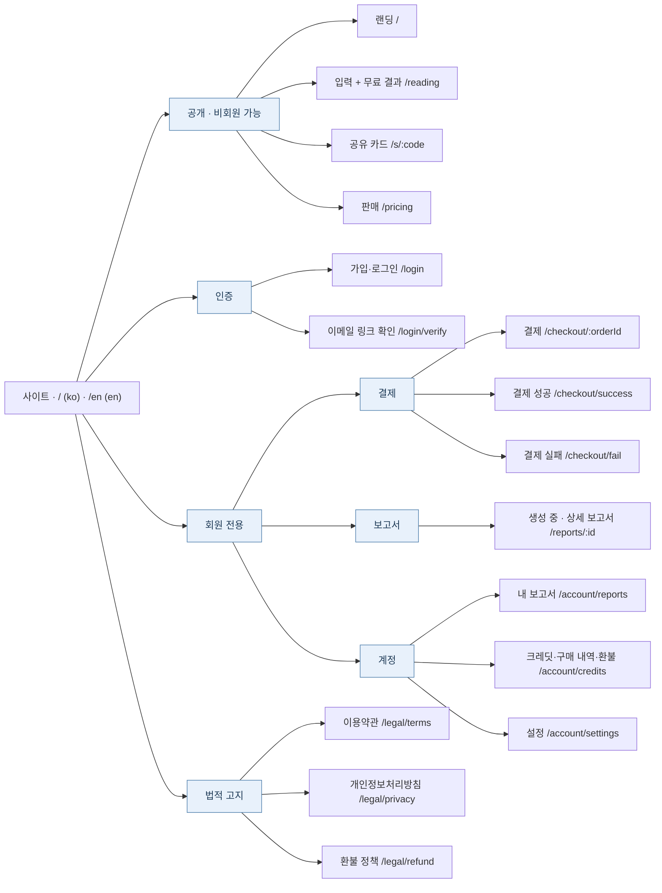

# 사이트맵 (초안)

Status: 제안 · 기준: [정책 v0.1.0](policies/README.md)

경로는 한국어 기준이다. 영어는 같은 경로 앞에 `/en`이 붙는다 (I18N-001). 예: `/pricing` ↔ `/en/pricing`.

페이지 사이의 이동 흐름은 [유저 저니](user-journey.md)를 본다.

## 페이지 목록

| 영역 | 페이지 | 경로 | 접근 | 주요 정책 |
| --- | --- | --- | --- | --- |
| 공개 | 랜딩 | `/` | 모두 | 서비스 소개 + CTA "시작하기" → `/reading`. 입력 폼은 두지 않는다. I18N-006 |
| 공개 | 입력 + 무료 결과 | `/reading` | 모두 | 한 화면에서 입력하면 아래에 무료 결과가 나온다. SAJU-001, MEM-003 (입력값은 브라우저에만) |
| 공개 | 공유 카드 | `/s/:code` | 모두 | 명식 코드만 · 개인정보 없음 · 일간별 OG 이미지 |
| 공개 | 판매 | `/pricing` | 모두 | PAY-008 (Free · 1 · 3 · 10★ · 100) |
| 인증 | 가입·로그인 | `/login` | 비회원 | MEM-004, MEM-006, MEM-007 |
| 인증 | 이메일 링크 확인 | `/login/verify` | 비회원 | MEM-004 |
| 결제 | 결제 | `/checkout/:orderId` | 회원 | PAY-010, PAY-012 |
| 결제 | 결제 성공 | `/checkout/success` | 회원 | PAY-030~032 (승인 후 크레딧 지급) |
| 결제 | 결제 실패 | `/checkout/fail` | 회원 | PAY-034 |
| 보고서 | 생성 중 · 상세 보고서 | `/reports/:id` | 회원 (본인) | AIU-003, AIU-005, PAY-020 |
| 계정 | 내 보고서 | `/account/reports` | 회원 | SAJU-006 (보류) |
| 계정 | 크레딧·구매 내역·환불 | `/account/credits` | 회원 | PAY-021, PAY-040~045 |
| 계정 | 설정 | `/account/settings` | 회원 | MEM-008 (언어·국가·마케팅 동의 · 데이터 내보내기 · 탈퇴) |
| 법적 | 이용약관 · 개인정보처리방침 · 환불 정책 | `/legal/*` | 모두 | MEM-006, MEM-011, PAY-040~045 |

- 헤더·푸터 공통 요소: 언어 전환(ko ↔ en), 로그인·계정, 크레딧 잔액(회원), 법적 고지 링크, 쿠키 동의 배너(EU).
- 로그인이 필요한 페이지에 비회원이 들어오면 `/login`으로 보내고, 가입 후 원래 페이지로 돌아온다.
- 무료 결과의 **"상세 보기"** 동작:

  | 상태 | 이동 |
  | --- | --- |
  | 비로그인 | `/login` → 가입·로그인 후 `/reading`으로 복귀 (브라우저의 입력값을 계정에 저장) |
  | 로그인 · 크레딧 부족 | `/pricing` → 결제 → 보고서 생성 |
  | 로그인 · 크레딧 충분 | 확인 후 바로 보고서 생성 (`/reports/:id`) |

## 이메일 알림

| 알림 | 시점 | 정책 |
| --- | --- | --- |
| 로그인 링크 | 이메일 로그인 요청 시 | MEM-004 |
| 결제 영수증 | 결제 완료 | PAY-013 (Toss 발송) |
| 보고서 완료 | 상세 보고서 생성 완료 | AIU-003 |
| 크레딧 만료 예정 | 만료 30일 전 | PAY-023 |
| 환불 완료 | 환불 처리 후 | PAY-045 |
| 탈퇴 완료 | 탈퇴 처리 후 | MEM-009 |

## 정하지 않은 것

- 보고서 공유 링크를 회원 보고서에도 제공할지 (SAJU-005 보류)
