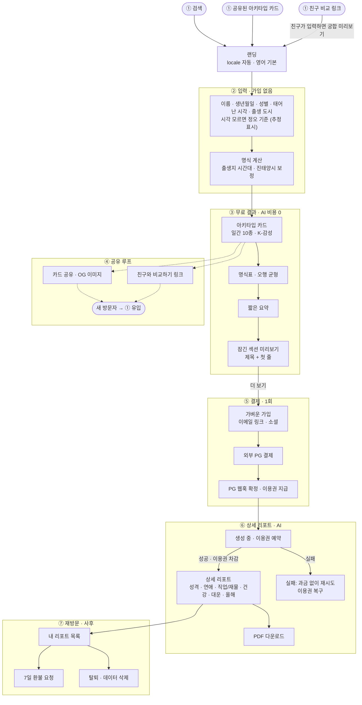
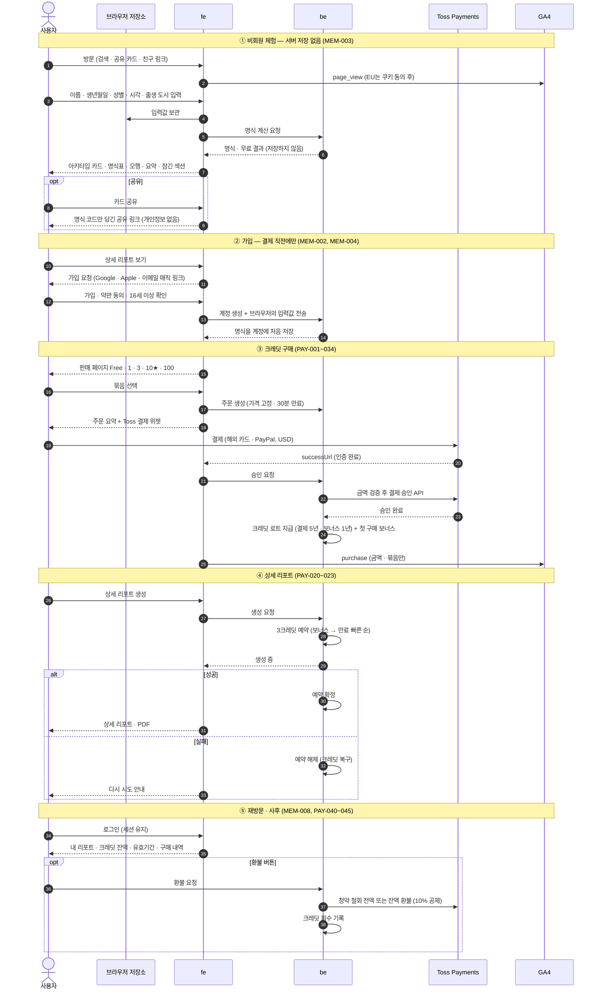

# 유저 저니 (초안)

Status: 제안 · 2026-09-25

근거: [경쟁 서비스 분석](research/competitive-analysis.md). 비회원 무료 짧은 리포트 → 1회 결제 상세 리포트, 구독 없음,
대화형이 아니라 입력하면 결과가 나오는 형태.

## 단계별 도메인

| 단계 | 주 도메인 | 핵심 정책 |
| --- | --- | --- |
| ① 유입 · 랜딩 | i18n | 영어 기본, 지원하지 않는 locale은 en |
| ② 입력 | 사주 · 회원 | 동양 사주 기준만 사용. 이름·생년월일·성별 입력, 시각과 도시는 최대한 받되 시각을 모르면 정오로 계산하고 시주를 추정으로 표시. 출생지 시간대 → UTC 저장. 이름은 표시용이며 LLM에 보내지 않음 |
| ③ 무료 결과 | 사주 · i18n | AI 호출 없음, 미리 써둔 콘텐츠, 같은 입력이면 같은 결과 |
| ④ 공유 루프 | 사주 | 카드·요약만 공개, 상세 리포트는 비공개. 점선은 선택 흐름 |
| ⑤ 결제 | 회원 · 결제 | 결제 시점 가입, 결제 확정은 웹훅 기준, 멱등 처리 |
| ⑥ 상세 리포트 | 사주 · AI 사용 내역 · 결제 | 이용권 예약 → 성공 시 차감 / 실패 시 복구, 호출마다 비용 기록·한도 확인 |
| ⑦ 재방문 · 사후 | 회원 · 결제 | 리포트 재열람 보장, 7일 환불, 탈퇴 시 개인정보 삭제·결제 기록은 분리 보관 |

## 상세 흐름 — 방문부터 가입·결제·리포트까지

회원 정책([members.md](policies/members.md))과 결제 정책([payments.md](policies/payments.md))을 반영한 흐름이다.

